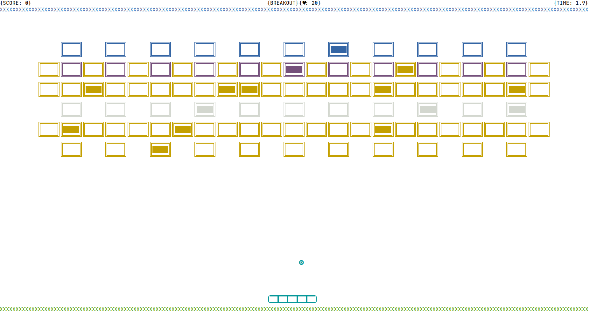
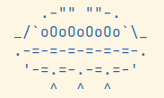
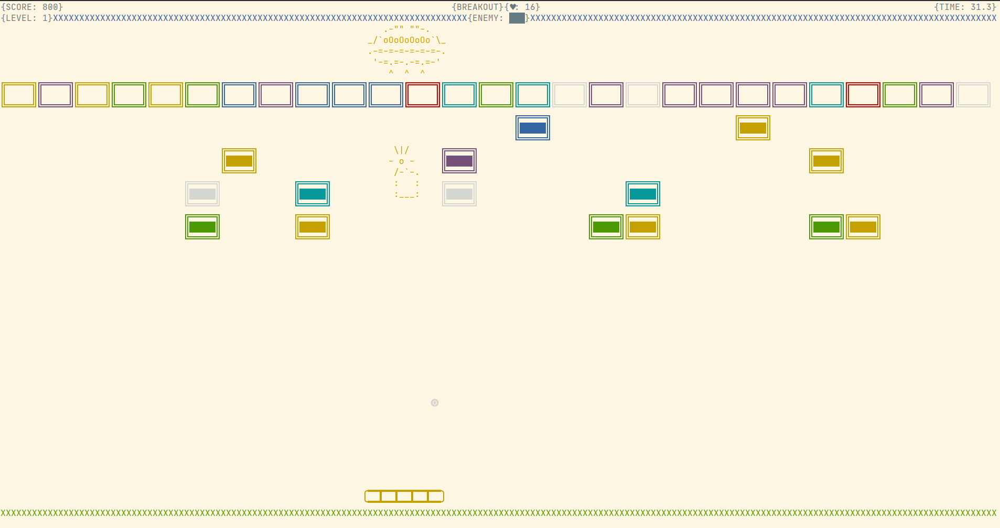
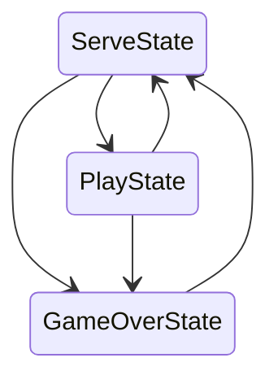

# BREAKOUT 2.0 [TERMINAL-BASED]

> Programmed by Ashwin Mittal

> A quick guide to starting the game.

> Play in full-screen mode.

## Screenshots

### Game



### Boss Enemy



### Last Level



## State Flow



## Running

Once you have downloaded it, run the following command to install the required Python packages for this project. Then,
you should be able to run `python3 main.py` to play.

```bash
$ pip3 install -r requirements.txt
```

## Background

The game is made using the state machine concept, which maintains the states easily and smoothly. There can be a maximum
of six types of bricks in a game which depends on randomization. Here types mean different strengths, and their strength
decreases when hit by a ball unless it is unbreakable, which breaks if the player (paddle) has _ThruBall_ powerup or
they are neighbors of the exploding bricks. There are eight types of powerups implemented using classes. Sprite of each
powerup has a letter written on it which tells which powerup is this. At the same time, a top-most row has the total
score, healths remaining, and the total time taken in seconds up to one decimal place.

### Boss Enemy (Last level but not the least level)

- The final level of the game will have the boss enemy along with a few unbreakable bricks.

- The boss enemy is a UFO that flies at the top of the screen and follows the paddle (moves along with it).

- The UFO drops bombs in regular intervals of five seconds (in the play state) onto the paddle. On being hit by these
  bombs, the paddle loses one life.

- The UFO has health, which reduces hitting it directly with the ball (showing health bar as well).

- The UFO will spawn defensive bricks around it(not unbreakable ones) after its health falls below three and two. These
  bricks will form a layer under the UFO, and breaking these bricks would not yield a powerup.

### Object-Oriented Programming System

- **Encapsulation:** The process of multiple binding objects into a single entity. Here, I am using classes for data
  binding related to a particular entity. So Encapsulation is imparted in the project.

- **Abstraction:** This is also called data hiding. In this concept, we will hide the internal representation of an
  object from the user and show them the limited information according to their requirement. Example: _checkVictory()_
  function, and there are many more.

- **Inheritance:** It is the concept of data reusability in which we will reuse the members of one base class in the
  subclass. Example: _BaseState_ class is inherited by every state class, etc.

- **Polymorphism:** It is the concept in which a single function or object will act differently in a different
  environment. For example, each of the state calls has its own _enter_(), _update()_, _render()_, and _exit_()
  functions that are overriding from the _BaseState_ class.

## Instructions

- A and D keys move the paddle in left and right directions, respectively.
- K key to shoot the bullets when paddle has _ShootingPaddle_ powerup.
- `Enter` to skip a particular level and go to the next level.
- Q key to quit the game.

### Enjoy the game!
